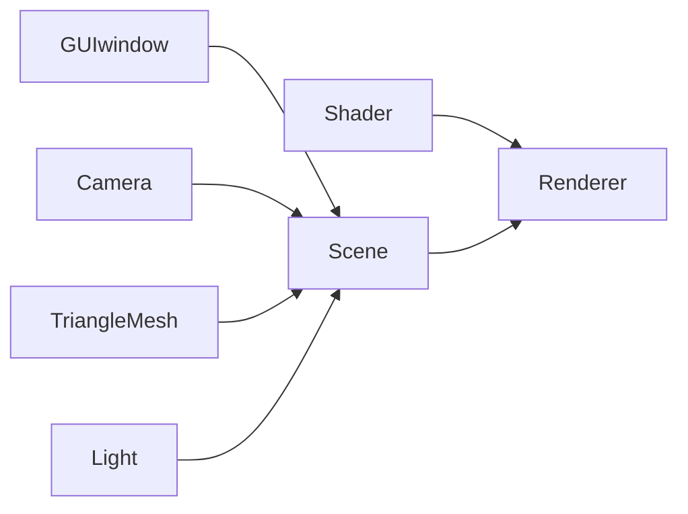

# ToySoftRenderer

My implementation of basic rendering algorithm in computer graphics. 

## Configuration

### Required

- xmake: see installation in [document](https://xmake.io/#/guide/installation).
- cpp compiler: g++, MSVC.

### Compile

```bash
xmake f -m release
xmake
```

- Use `xmake f -m debug` to switch to debug mode.
- There are some thirdparty packages to be downloaded. If there's trouble in network, consider following solutions:;
  - `xmake g --proxy_pac=github_mirror.lua`
  - `xmake g --pkg_searchdirs=<download-dir>`
  - VPN

## Usage

Use `.json` file to set the renderer. Default input is `config.json`. There are also some examples in `configs`.

```bash
xmake run
# equal to
./bin/ToySoftRenderer.exe
# equal to
./bin/ToySoftRenderer.exe -c config.json
```

One can edit custom `.json` files, setting renderer, camera parameters, screen size, lights and objects. Just imitate files in `configs`.

## Feature List

- [x] interactive GUI window: FLTK
  - only basic api used: image display, mouse event handling
  - rotation, tanslation and sacling of the view camera
- [x] load `.obj` file: [tinyobjloader](https://github.com/tinyobjloader/tinyobjloader)
  - support triangle meshes
  - support loading vertices, normals, uvs and materials
- [x] render wireframe
- [x] basic shading algorithm
  - Blinn-Phong reflection model
  - z-buffer method
  - diffuse, specular and shininess mapping
  - only point lights
  - normal mapping
  - [ ] customized shading function
- [ ] mipmap
- [ ] MSAA
- [ ] physically based rendering
  - [ ] path tracing
  - [ ] BSDF
  - [ ] BVH acceleration

## Framework


